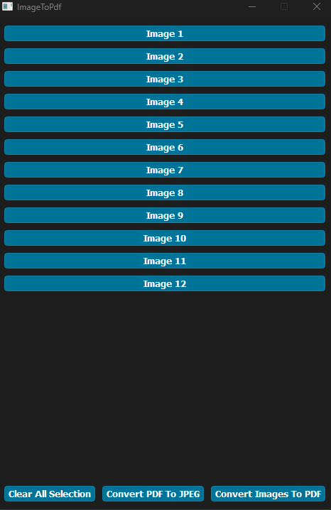

# About ImageToPDF:

ImageToPDF is a GUI app that convert images to PDF also a PDF files to images.

Creeated using PySide6 + PyPDF2 + Poppler

Binary build using Pyinstaller

Tested on windows 10 + 11 using python 3.6+

[Binary available here](https://github.com/overcrash66/ImageToPDF/releases/download/v0.2/ImageToPdf.zip)

# Install:

``https://blog.alivate.com.au/poppler-windows/``

``Download "Latest binary : poppler-0.68.0_x86"``

``Add poppler to env path``

``pip install -r requirements.txt``

``Run ImageToPdf.py``

# Options:

Python_Lib.exe/py can be used as standalone or from ImageToPDF.exe/py

### FYI: (ugly code but it works as it works don't touch it) No new updates will be provided (maybe).  