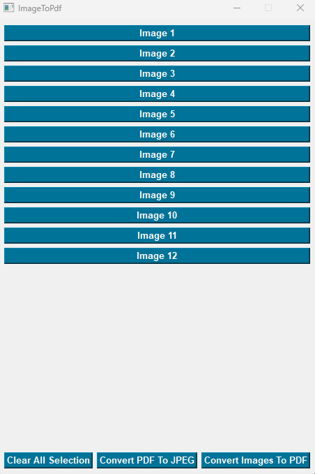

# About ImageToPDF:

ImageToPDF is a GUI app that convert images to PDF also a PDF files to images.

Creeated using PySide6 + PyPDF2 + Poppler

Binary build using Pyinstaller

Tested on windows 10 + 11 using python 3.6+

# Install:

``pip install -r requirements.txt``

``Run ImageToPdf.py``

# Options:

Python_Lib.exe/py convert PDF to image
Python_Lib.exe/py can be used as standalone or from ImageToPDF.exe/py

### FYI: 	No new updates will be provided.  